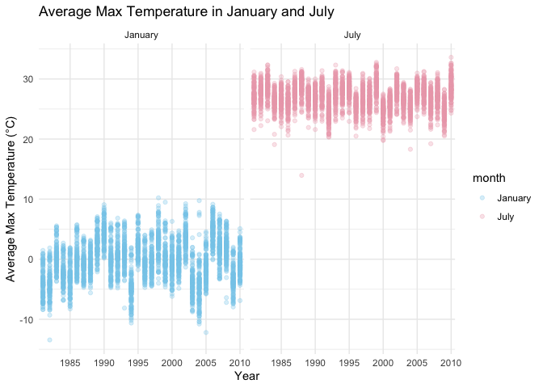
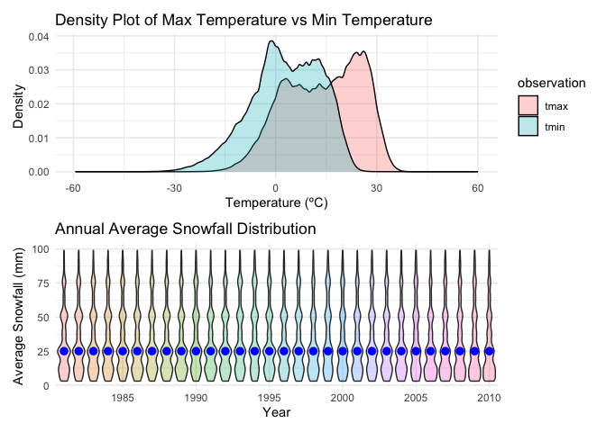

hw3_problems
================
David
2024-10-03

Loading necessary packages for homework 3.

## Problem 1

Tidying the dataset, initial cleaning and separate date into year, month
and day. Also converted data into numeric form (precipitation,
temperature need to be divided by 10)

``` r
ny_noaa =
  ny_noaa |>
  janitor::clean_names() |>
  separate(date, into = c("year", "month", "day"), sep = "-", remove = TRUE) |>
  mutate(
    prcp = as.numeric(prcp) / 10,
    snow = as.numeric(snow),
    snwd = as.numeric(snwd),
    tmax = as.numeric(tmax) / 10,
    tmin = as.numeric(tmin) / 10
  )
```

Identify top 10 most commonly observed snowfall values

``` r
common_snowfall = ny_noaa |>
  filter(!is.na(snow)) |>
  count(snow) |>
  arrange(desc(n))

common_snowfall |>
  head(10) |>
  knitr::kable(
    caption = "Table: Top 10 Most Commonly Observed Snowfall Values",
    col.names = c("Snowfall (mm)", "Count"),
    align = "c"
  )
```

| Snowfall (mm) |  Count  |
|:-------------:|:-------:|
|       0       | 2008508 |
|      25       |  31022  |
|      13       |  23095  |
|      51       |  18274  |
|      76       |  10173  |
|       8       |  9962   |
|       5       |  9748   |
|      38       |  9197   |
|       3       |  8790   |
|      102      |  6552   |

Table: Top 10 Most Commonly Observed Snowfall Values

The most common value of snowfall in New York from 1981 to 2010 is **0
mm**. Notably, the second common value of snowfall is much less than the
most common value, meaning snowfall events are relatively infrequent
compared to days with no snow in survailance area.

Make a two-panel plot showing the average max temperature in January and
in July in each station across years.

``` r
tmax_plot = 
  ny_noaa |>
  filter(month == "01" | month == "07") |>
  drop_na(tmax) |>
  group_by(id, year, month) |>
  summarise(mean_station_month = mean(tmax)) |>
  mutate(
    month = case_when(
      month == "01" ~ "January",
      month == "07" ~ "July"
    )
  )
```

    ## `summarise()` has grouped output by 'id', 'year'. You can override using the
    ## `.groups` argument.

``` r
tmax_plot |>
  ggplot(aes(x = year, y = mean_station_month, color = month)) +
  scale_color_manual(values = c("January" = "skyblue", "July" = "pink2")) +
  geom_point(alpha = 0.3) +
  facet_grid(. ~ month) +
  labs(
    title = "Average Max Temperature in January and July",
    x = "Year",
    y = "Average Max Temperature (°C)"
  ) +
  theme_minimal() +
  scale_x_discrete(breaks = seq(1980, 2010, by = 5))
```

<!-- -->

Two panels represent January(winter) and July(summer) temperature,
demonstrating expected seasonal fluctuation, where January often have
temperature around or below 0°C, while July often have warmer weather
with average temperature typically around 20-30°C. There are a few
individual data points below -10°C in some years, indicating extreme
cold days. In the July panel, there are occasional data points much
lower than the rest, potentially indicating anomalously cool summer days
or errors in data recording.

Draw two panel plot showing max vs min temperature and the distribution
of snowfall values greater than 0 and less than 100 separately by year.

``` r
tmax_tmin_density_plot =
  ny_noaa |>
  select(tmax, tmin) |>
  pivot_longer(
    tmax:tmin,
    names_to = "observation", 
    values_to = "temp") |> 
  ggplot(aes(x = temp, fill = observation)) +
  geom_density(alpha = 0.3) +
  labs(
    title = "Density Plot of Max Temperature vs Min Temperature",
    x = "Temperature (ºC)",
    y = "Density"
  ) +
  theme_minimal()

snowfall_violin_plot = 
  ny_noaa |>
  filter(snow > 0 & snow < 100) |>
  group_by(year) |>
  ggplot(aes(x = year, y = snow)) +
  geom_violin(aes(fill = year), alpha = 0.3) +
  stat_summary(fun = "median", color = "blue") +
  labs(
    title = "Annual Average Snowfall Distribution",
    x = "Year",
    y = "Average Snowfall (mm)"
  ) +
  theme_minimal() +
  theme(legend.position = "none") +
  scale_x_discrete(breaks = seq(1980, 2010, by = 5))

tmax_tmin_density_plot / snowfall_violin_plot
```

    ## Warning: Removed 2268778 rows containing non-finite outside the scale range
    ## (`stat_density()`).

    ## Warning: Removed 30 rows containing missing values or values outside the scale range
    ## (`geom_segment()`).

<!-- -->

There is a distinguished difference between max teperature and min
temperature across all station. The snowfall distribution within 0 -
100mm is similar across all years.

## Problem 2

To that end, write a short description of the dataset. noting the size
and structure of the data, describing some key variables, and indicating
the extent to which missing data is an issue
