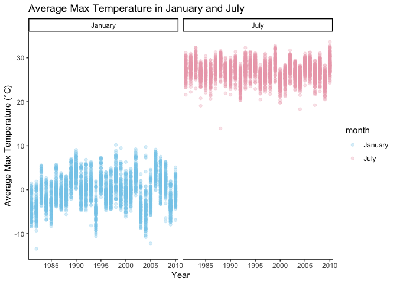

hw3_problems
================
David
2024-10-03

Loading necessary packages for homework 3.

## Problem 1

The dataset contains **2,595,176** rows of data and have **6** variables
**besides id**. The dataset have date of record (yyyy-mm-dd),
precipitation (tenths of mm), snowfall (mm), snow depth (mm), maximum
temperature (tenths of ºC) and minimum temperature (tenths of ºC) on the
recording day.

The NAs of the dataset take up a large proportion, shown as below, the
minimum NA amount is precipitation data (**145,838** missing), and the
maximum NA amount is minimum temperature (**1,134,420** missing),
addressing further cleaning of the dataset.

``` r
ny_noaa |>
  summarise(
    `NAs of prcp` = sum(is.na(prcp)),
    `NAs of snow` = sum(is.na(snow)),
    `NAs of snwd` = sum(is.na(snwd)),
    `NAs of tmax` = sum(is.na(tmax)),
    `NAs of tmin` = sum(is.na(tmin))
  ) |>
  knitr::kable(align = "c")
```

| NAs of prcp | NAs of snow | NAs of snwd | NAs of tmax | NAs of tmin |
|:-----------:|:-----------:|:-----------:|:-----------:|:-----------:|
|   145838    |   381221    |   591786    |   1134358   |   1134420   |

Tidying the dataset, initial cleaning and separate date into year, month
and day. Also converted data into numeric form (precipitation,
temperature need to be divided by 10)

``` r
ny_noaa =
  ny_noaa |>
  janitor::clean_names() |>
  separate(date, into = c("year", "month", "day"), sep = "-", remove = TRUE) |>
  mutate(
    prcp = as.numeric(prcp) / 10,
    snow = as.numeric(snow),
    snwd = as.numeric(snwd),
    tmax = as.numeric(tmax) / 10,
    tmin = as.numeric(tmin) / 10
  )
```

Identify top 10 most commonly observed snowfall values.

``` r
common_snowfall = ny_noaa |>
  filter(!is.na(snow)) |>
  count(snow) |>
  arrange(desc(n))

common_snowfall |>
  head(10) |>
  knitr::kable(
    caption = "Table: Top 10 Most Commonly Observed Snowfall Values",
    col.names = c("Snowfall (mm)", "Count"),
    align = "c"
  )
```

| Snowfall (mm) |  Count  |
|:-------------:|:-------:|
|       0       | 2008508 |
|      25       |  31022  |
|      13       |  23095  |
|      51       |  18274  |
|      76       |  10173  |
|       8       |  9962   |
|       5       |  9748   |
|      38       |  9197   |
|       3       |  8790   |
|      102      |  6552   |

Table: Top 10 Most Commonly Observed Snowfall Values

The most common value of snowfall in New York from 1981 to 2010 is **0
mm**. Notably, the second common value of snowfall is much less than the
most common value, meaning snowfall events are relatively infrequent
compared to days with no snow in surveilance area.

Make a two-panel plot showing the average max temperature in January and
in July in each station across years.

``` r
tmax_plot = 
  ny_noaa |>
  filter(month == "01" | month == "07") |>
  drop_na(tmax) |>
  group_by(id, year, month) |>
  summarise(mean_station_month = mean(tmax)) |>
  mutate(
    month = case_when(
      month == "01" ~ "January",
      month == "07" ~ "July"
    )
  )
```

    ## `summarise()` has grouped output by 'id', 'year'. You can override using the
    ## `.groups` argument.

``` r
tmax_plot |>
  ggplot(aes(x = year, y = mean_station_month, color = month)) +
  scale_color_manual(values = c("January" = "skyblue", "July" = "pink2")) +
  geom_point(alpha = 0.3) +
  facet_grid(. ~ month) +
  labs(
    title = "Average Max Temperature in January and July",
    x = "Year",
    y = "Average Max Temperature (°C)"
  ) +
  scale_x_discrete(breaks = seq(1980, 2010, by = 5)) +
  theme_classic()
```

<!-- -->

Two panels represent January(winter) and July(summer) temperature,
demonstrating expected seasonal fluctuation, where January often have
temperature around or below 0°C, while July often have warmer weather
with average temperature typically around 20-30°C. There are a few
individual data points below -10°C in some years, indicating extreme
cold days. In the July panel, there are occasional data points much
lower than the rest, potentially indicating anomalously cool summer days
or errors in data recording.

Draw two panel plot showing max vs min temperature and the distribution
of snowfall values greater than 0 and less than 100 separately by year.

``` r
tmax_tmin_density_plot =
  ny_noaa |>
  select(tmax, tmin) |>
  drop_na(tmax, tmin) |>
  pivot_longer(
    tmax:tmin,
    names_to = "observation", 
    values_to = "temp") |> 
  ggplot(aes(x = temp, fill = observation)) +
  geom_density(alpha = 0.3) +
  labs(
    title = "Density Plot of Max Temperature vs Min Temperature",
    x = "Temperature (ºC)",
    y = "Density"
  ) +
  theme_classic()

snowfall_violin_plot = 
  ny_noaa |>
  drop_na(snow) |>
  filter(snow > 0 & snow < 100) |>
  group_by(year) |>
  ggplot(aes(x = year, y = snow)) +
  geom_violin(aes(fill = year), alpha = 0.3) +
  stat_summary(fun = "median", color = "blue") +
  labs(
    title = "Annual Average Snowfall Distribution",
    x = "Year",
    y = "Average Snowfall (mm)"
  ) +
  scale_x_discrete(breaks = seq(1980, 2010, by = 5)) +
  theme_classic() +
  theme(legend.position = "none")

tmax_tmin_density_plot / snowfall_violin_plot
```

    ## Warning: Removed 30 rows containing missing values or values outside the scale range
    ## (`geom_segment()`).

<!-- -->

There is a distinguished difference between max temperature and min
temperature across all station. The snowfall distribution within 0 -
100mm is similar across all years.

## Problem 2

Loading, tidying, merging, organizing the dataset.

``` r
accel_dt = 
  read_csv("./data/nhanes_accel.csv", na = c("NA", "", ".")) |>
  janitor::clean_names()
```

    ## Rows: 250 Columns: 1441
    ## ── Column specification ────────────────────────────────────────────────────────
    ## Delimiter: ","
    ## dbl (1441): SEQN, min1, min2, min3, min4, min5, min6, min7, min8, min9, min1...
    ## 
    ## ℹ Use `spec()` to retrieve the full column specification for this data.
    ## ℹ Specify the column types or set `show_col_types = FALSE` to quiet this message.

``` r
covar_dt = 
  read_csv("./data/nhanes_covar.csv", skip = 4, na = c("NA", "", ".")) |>
  janitor::clean_names()
```

    ## Rows: 250 Columns: 5
    ## ── Column specification ────────────────────────────────────────────────────────
    ## Delimiter: ","
    ## dbl (5): SEQN, sex, age, BMI, education
    ## 
    ## ℹ Use `spec()` to retrieve the full column specification for this data.
    ## ℹ Specify the column types or set `show_col_types = FALSE` to quiet this message.

``` r
nhanes_dt = 
  left_join(covar_dt, accel_dt, by = "seqn") |>
  drop_na(sex, age, bmi, education) |>
  filter(age >= 21) |>
  mutate(
    seqn = as.factor(seqn),
    sex = case_when(
      sex == 1 ~ "male",
      sex == 2 ~ "female"
    ),
    age = as.numeric(age),
    education = case_when(
      education == 1 ~ "less than high school",
      education == 2 ~ "high school equivalent",
      education == 3 ~ "above high school"
    )
  )
```

Producing a reader-friendly table for the number of men and women in
each education category.

``` r
nhanes_dt |>
  group_by(sex, education) |>
  summarise(count = n()) |>
  pivot_wider(names_from = "education", values_from = "count") |>
  knitr::kable(
    caption = "Table: Counts of Participants in Different Education Levels and Sex",
    align = "c")
```

    ## `summarise()` has grouped output by 'sex'. You can override using the `.groups`
    ## argument.

|  sex   | above high school | high school equivalent | less than high school |
|:------:|:-----------------:|:----------------------:|:---------------------:|
| female |        59         |           23           |          28           |
|  male  |        56         |           35           |          27           |

Table: Counts of Participants in Different Education Levels and Sex

People with education level above high school is the most common in both
sex, which take up approximately 50%. People with education level
equivalent to high school or lower than high school take up roughly
similar 20 - 30% proportion in both sex.

Creating a visualization of the age distributions for men and women in
each education category.

``` r
nhanes_dt |>
  ggplot(aes(x = age, fill = sex)) +
  geom_density(alpha = 0.3) +
  facet_grid(. ~ education) +
  viridis::scale_fill_viridis(discrete = TRUE) +
  labs(
    title = "Age Density Plot in Different Education Levels and Sex",
    x = "Age (years)",
    y = "Density"
  ) +
  theme_classic()
```

<!-- -->

People with education level higher than high school appear to have
younger age, especially in female, on contrary, female appear to have
older age in education level equivalent to or lower than high school
compared with male subjects.

Plotting total activities against age, comparing men to women and
different education level at same time.

``` r
nhanes_dt |>
  mutate(min_total = rowSums(across(min1:min1440), na.rm = TRUE)) |>
  ggplot(aes(x = age, y = min_total, color = sex)) +
  geom_point(alpha = 0.3) +
  geom_smooth(se = TRUE) +
  facet_grid(. ~ education) +
  labs(
    title = "Scatterplot of Total Activity Level Tested by Accelerometers and Age Across Different Education Level and Sex",
    x = "Age (years)",
    y = "Total activity Level"
  ) +
  theme_classic()
```

    ## `geom_smooth()` using method = 'loess' and formula = 'y ~ x'

<!-- -->

This plot indicates that there is a overall decrease trend in total
activity level along with the increase of age across all education
level. People in less-than-high-school group tend to have the most
dramatic decrease. Sex difference was observed, but without further
statistic confirmation, no conclusion could be determined.

Making a three-panel plot that shows the 24-hour activity time courses
for each education level and use color to indicate sex.

``` r
nhanes_dt |>
  pivot_longer(
    min1:min1440,
    names_to = "min",
    names_prefix = "min",
    values_to = "pa_level"
  ) |>
  mutate(
    min = as.numeric(min) / 60
  ) |>
  ggplot(aes(x = min, y = pa_level, color = sex)) +
  scale_color_manual(values = c("male" = "orange2", "female" = "purple3")) +
  geom_point(alpha = 0.05) +
  geom_smooth(se = FALSE, linewidth = 1.5) +
  facet_grid(. ~ education) +
  labs(
    title = "24-Hour Activity Time Course for Each Education Level and Sex",
    x = "Time in a day (hours)",
    y = "Activity Level"
  ) +
  scale_x_continuous(breaks = seq(0, 24, by = 4)) +
  theme_classic()
```

    ## `geom_smooth()` using method = 'gam' and formula = 'y ~ s(x, bs = "cs")'

<!-- -->

This plot showed patterns of daily activity intensity across all
education groups, a decline from 20:00 to 5:00, then an increase from
5:00 to approximately 12:00, at last a plateau from 12:00 to 20:00
(slightly decline in less than high school group). This pattern was
observed among all groups and both sex.

## Problem 3

Import, clean, and tidy these data, and describe the resulting dataset
of Citi bike.

``` r
jan_2020 =
  read_csv("./data/citibike/Jan 2020 Citi.csv") |>
  janitor::clean_names() |>
  relocate(ride_id, member_casual) |>
  arrange(member_casual, rideable_type) |>
  mutate(
    member_casual = as.factor(member_casual),
    rideable_type = as.factor(rideable_type),
    weekdays = as.factor(weekdays)
  )
```

    ## Rows: 12420 Columns: 7
    ## ── Column specification ────────────────────────────────────────────────────────
    ## Delimiter: ","
    ## chr (6): ride_id, rideable_type, weekdays, start_station_name, end_station_n...
    ## dbl (1): duration
    ## 
    ## ℹ Use `spec()` to retrieve the full column specification for this data.
    ## ℹ Specify the column types or set `show_col_types = FALSE` to quiet this message.

``` r
jul_2020 =
  read_csv("./data/citibike/July 2020 Citi.csv") |>
  janitor::clean_names() |>
  relocate(ride_id, member_casual) |>
  arrange(member_casual, rideable_type) |>
  mutate(
    member_casual = as.factor(member_casual),
    rideable_type = as.factor(rideable_type),
    weekdays = as.factor(weekdays)
  )
```

    ## Rows: 21048 Columns: 7
    ## ── Column specification ────────────────────────────────────────────────────────
    ## Delimiter: ","
    ## chr (6): ride_id, rideable_type, weekdays, start_station_name, end_station_n...
    ## dbl (1): duration
    ## 
    ## ℹ Use `spec()` to retrieve the full column specification for this data.
    ## ℹ Specify the column types or set `show_col_types = FALSE` to quiet this message.

``` r
jan_2024 =
  read_csv("./data/citibike/Jan 2024 Citi.csv") |>
  janitor::clean_names() |>
  relocate(ride_id, member_casual) |>
  arrange(member_casual, rideable_type) |>
  mutate(
    member_casual = as.factor(member_casual),
    rideable_type = as.factor(rideable_type),
    weekdays = as.factor(weekdays)
  )
```

    ## Rows: 18861 Columns: 7
    ## ── Column specification ────────────────────────────────────────────────────────
    ## Delimiter: ","
    ## chr (6): ride_id, rideable_type, weekdays, start_station_name, end_station_n...
    ## dbl (1): duration
    ## 
    ## ℹ Use `spec()` to retrieve the full column specification for this data.
    ## ℹ Specify the column types or set `show_col_types = FALSE` to quiet this message.

``` r
jul_2024 =
  read_csv("./data/citibike/July 2024 Citi.csv") |>
  janitor::clean_names() |>
  relocate(ride_id, member_casual) |>
  arrange(member_casual, rideable_type) |>
  mutate(
    member_casual = as.factor(member_casual),
    rideable_type = as.factor(rideable_type),
    weekdays = as.factor(weekdays)
  )
```

    ## Rows: 47156 Columns: 7
    ## ── Column specification ────────────────────────────────────────────────────────
    ## Delimiter: ","
    ## chr (6): ride_id, rideable_type, weekdays, start_station_name, end_station_n...
    ## dbl (1): duration
    ## 
    ## ℹ Use `spec()` to retrieve the full column specification for this data.
    ## ℹ Specify the column types or set `show_col_types = FALSE` to quiet this message.

The datasets have 4 months data: January 2020, July 2020, January 2024
and July 2024. Each of them contains 7 variables: user id, membership
status, ride type, ride day, starting point and ending point. The amount
of data records increased with time, from **12,420** records in January
2020 to **47,156** records in July 2024.

Producing a reader-friendly table showing the total number of rides in
each combination of year and month separating casual riders and Citi
Bike members. Comment on these results.

``` r
jan_2020 = jan_2020 |>
  mutate(
    year = 2020,
    month = "January"
  )

jul_2020 = jul_2020 |>
  mutate(
    year = 2020,
    month = "July"
  )

jan_2024 = jan_2024 |>
  mutate(
    year = 2024,
    month = "January"
  )

jul_2024 = jul_2024 |>
  mutate(
    year = 2024,
    month = "July"
  )

all_rides <- bind_rows(jan_2020, jul_2020, jan_2024, jul_2024)

all_rides |>
  group_by(year, month, member_casual) |>
  summarize(total_rides = n()) |>
  arrange(year, month) |>
  knitr::kable(
    caption = "Total Number of Rides by Year, Month, and Rider Type",
    col.names = c("Year", "Month", "Rider Type", "Total Rides"),
    align = "c"
  )
```

    ## `summarise()` has grouped output by 'year', 'month'. You can override using the
    ## `.groups` argument.

| Year |  Month  | Rider Type | Total Rides |
|:----:|:-------:|:----------:|:-----------:|
| 2020 | January |   casual   |     984     |
| 2020 | January |   member   |    11436    |
| 2020 |  July   |   casual   |    5637     |
| 2020 |  July   |   member   |    15411    |
| 2024 | January |   casual   |    2108     |
| 2024 | January |   member   |    16753    |
| 2024 |  July   |   casual   |    10894    |
| 2024 |  July   |   member   |    36262    |

Total Number of Rides by Year, Month, and Rider Type

There is a decrease trend in membership of Citi bike with time, though
in January there is a reversal increase in membership proportion. This
result might due to the sample selection, or other unknown reasons
effecting people’s decision.

Making a table showing the 5 most popular starting stations for July
2024; including the number of rides originating from these stations.

``` r
jul_2024 |>
  group_by(start_station_name) |>
  summarise(amount = n()) |>
  arrange(desc(amount)) |>
  head(5) |>
  knitr::kable(
    caption = "5 Most Popular Starting Point of Citi Bike in July 2024",
    col.names = c("Starting Point name", "Amount"),
    align = "c"
  )
```

|   Starting Point name    | Amount |
|:------------------------:|:------:|
| Pier 61 at Chelsea Piers |  163   |
| University Pl & E 14 St  |  155   |
|     W 21 St & 6 Ave      |  152   |
|  West St & Chambers St   |  150   |
|     W 31 St & 7 Ave      |  146   |

5 Most Popular Starting Point of Citi Bike in July 2024

Making a plot to investigate the effects of day of the week, month, and
year on median ride duration. This plot can include one or more panels,
but should facilitate comparison across all variables of interest.
**(Duration was limited to below 50 to have better visualization of the
impact)**

``` r
all_rides |>
  mutate(
    weekdays = case_when(
      weekdays == "Monday" ~ "Mon",
      weekdays == "Tuesday" ~ "Tue",
      weekdays == "Wednesday" ~ "Wed",
      weekdays == "Thursday" ~ "Thu",
      weekdays == "Friday" ~ "Fri",
      weekdays == "Saturday" ~ "Sat",
      weekdays == "Sunday" ~ "Sun",
    ),
    weekdays = factor(weekdays, levels = c("Mon", "Tue", "Wed", "Thu", "Fri", "Sat", "Sun"))
  ) |>
  filter(duration <= 50) |>
  unite("year_month", year, month, sep = " ") |>
  ggplot(aes(x = weekdays, y = duration, color = year_month)) +
  geom_boxplot(alpha = 0.3) +
  facet_grid(. ~ year_month) +
  labs(
    title = "Effect of Weekdays on Riding Duration During Each Period of Time",
    x = "Weekdays",
    y = "Riding Duration (min)"
  ) +
  theme_classic()
```

<!-- -->

The plot indicates that the average riding duration in July 2020 was the
highest and in January 2024 was the lowest. There is a trend of
increasing average riding duration in weekends compared with weekdays
from Mon to Fri, probably due to recreational use, however, this trend
was not observed in January 2024. Thing might happened in this period
preventing people from riding Citi bike, further exploration in this
area could be implemented.

Making a figure that shows the impact of month, membership status, and
bike type on the distribution of ride duration in 2024. **(Duration was
limited to below 50 to have better visualization of the impact)**

``` r
all_rides |>
  filter(
    year == "2024",
    duration <= 50
    ) |>
  select(month, member_casual, rideable_type, duration) |> 
  mutate(
    rideable_type = case_when(
      rideable_type == "classic_bike" ~ "Classic Bike",
      rideable_type == "electric_bike" ~ "Electric Bike"
    ),
    member_casual = case_when(
      member_casual == "casual" ~ "Casual",
      member_casual == "member" ~ "Member"
    )
  ) |>
  ggplot(aes(x = month, y = duration, fill = month)) + 
  geom_violin(alpha = 0.5) +
  geom_boxplot(width = 0.2, alpha = 0.7) +
  facet_grid(member_casual ~ rideable_type) +
  labs(
    title = "Impact of Month, Membership Status, and Bike Type on the Distribution of Ride Duration in 2024",
    x = "Month",
    y = "Duration (min)"
  ) +
  theme_minimal()
```

<!-- -->

The plot shows that in January, people usually have longer duration,
might due to the weather in summer is more acceptable to the public.
Also, among casual members, the duration is longer riding classic bikes
than electric bikes, this might indicate the need for exercise and
recreation is more evident in these groups, while there is no such
difference among members. Notably, members have average riding duration
below 10 minutes, while people in casual group tend to have longer
riding duration, this might because the cost of using the bike is lower
in member group so that they prone to use them on short ride for
convenience.
